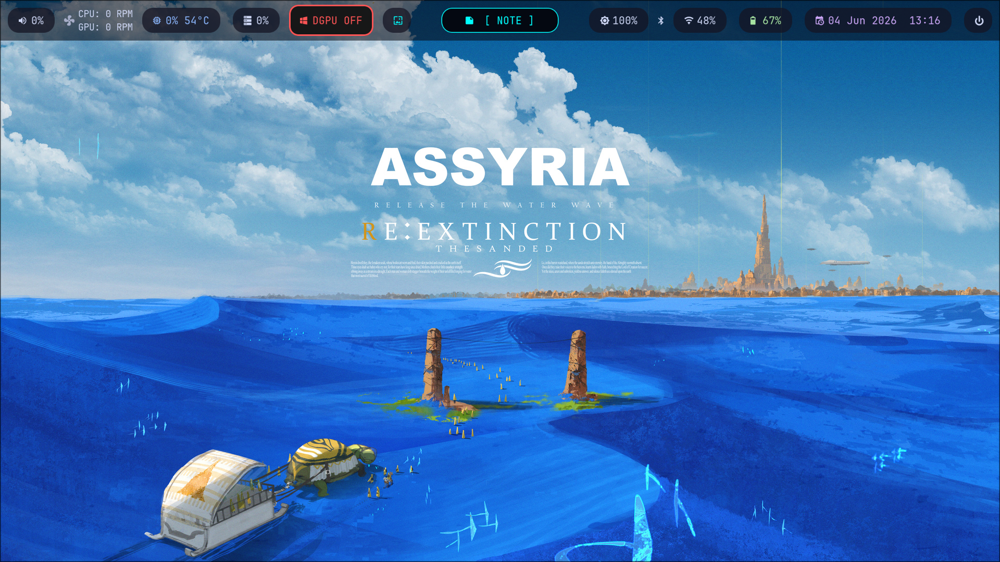
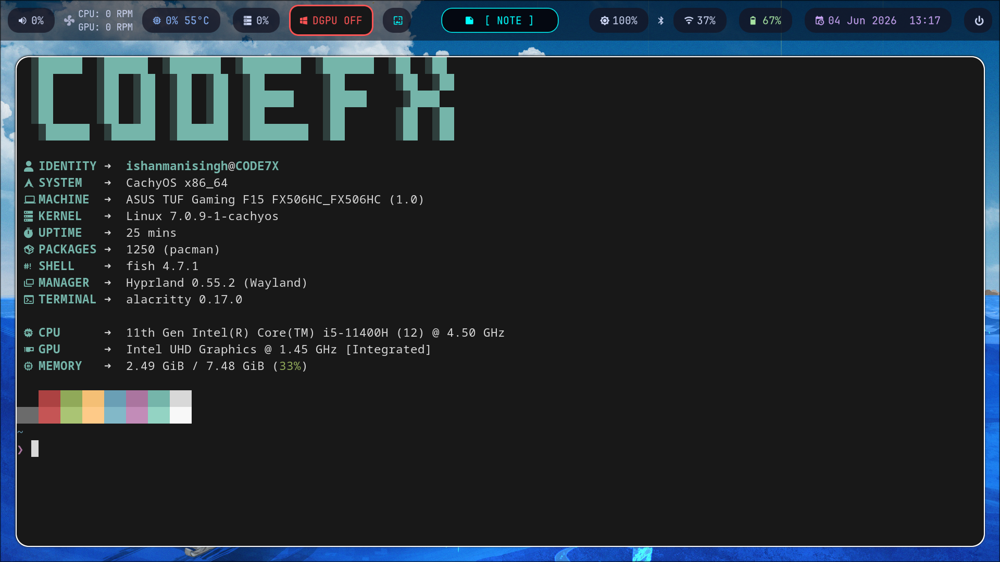
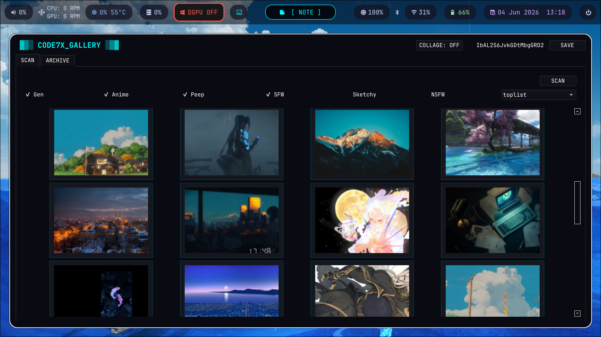
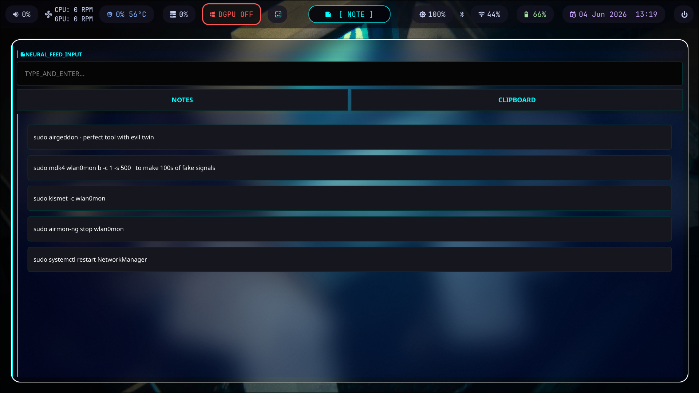
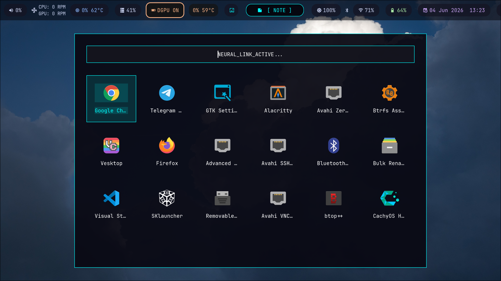

# Code7x Cyberpunk Dotfiles - CachyOS / Arch Linux (Wayland)

Welcome to my custom Hyprland dotfiles! This setup is highly customized for a Cyberpunk aesthetic, featuring custom-built GUI applications for wallpaper and note management, built entirely with Python and PyQt6. It is specifically tailored with hardware controls for the **ASUS TUF F15 (FX506HC)** but can be adapted for any system.

## 📸 Gallery

### Desktop Overview


### Terminal (Alacritty + Fastfetch)


### Code7x Gallery (Custom Wallpaper App)


### Code7x Sidebar (Notes & Clipboard)


### Rofi App Launcher


## 🚀 Features

* **Window Manager:** [Hyprland](https://hyprland.org/) (Wayland)
* **Status Bar:** Custom [Waybar](https://github.com/Alexays/Waybar) with integrated controls.
* **App Launcher / Menus:** [Rofi](https://github.com/davatorium/rofi) (Cyberpunk-themed).
* **Terminal Environment:** Alacritty + Fish Shell + Fastfetch.
* **Wallpaper Manager (`code7x_gallery.py`):** A custom PyQt6 GUI application to browse, fetch, and apply wallpapers natively.
* **Sidebar / Notes App (`code7x_sidebar.py`):** A beautiful, custom PyQt6 sliding sidebar for note-taking directly accessible via Waybar.
* **ASUS TUF F15 Hardware Controls:** 
  * Custom Waybar modules for toggling the NVIDIA dGPU on/off.
  * Real-time dGPU and iGPU monitoring.
  * CPU/GPU fan speed monitoring and controls.
  * Brightness and power profile management.

## ⌨️ Keybinds & Shortcuts

Here are the primary shortcuts configured in Hyprland (`SUPER` / `Windows Key` is the `$mainMod`):

### Custom Apps & Utilities
* **`SUPER + W`**: Launch **Code7x Gallery** (Custom Wallpaper Manager).
* **`SUPER + U`**: Toggle **Code7x Sidebar** (Custom Notes & Widget Panel).
* **`SUPER + R`**: Open **Rofi App Launcher** (Cyberpunk theme).
* **`SUPER + T`**: Open **Rofi Emoji Picker**.
* **`SUPER + SHIFT + V`**: Open **Clipboard History** (via Rofi + Cliphist).
* **`SUPER + K`**: Open **Kill Menu** (Custom script to kill rogue processes via Rofi).

### System Controls
* **`SUPER + Q`**: Open Terminal (`alacritty`).
* **`SUPER + E`**: Open File Manager (`thunar`).
* **`SUPER + C`**: Close/Kill active window.
* **`SUPER + L`**: Lock Screen (`hyprlock`).
* **`SUPER + M`**: Power/Exit Menu (`hyprshutdown` or exit Hyprland).
* **`SUPER + F`**: Toggle Fullscreen.
* **`SUPER + V`**: Toggle Floating Window.
* **`Print Screen`**: Screenshot (select area, copies to clipboard & saves to `~/Pictures/Screenshots`).
* **`SHIFT + Print Screen`**: Fullscreen Screenshot.

### Workspaces
* **`SUPER + 1-9`**: Switch to workspace 1-9.
* **`SUPER + SHIFT + 1-9`**: Move active window to workspace 1-9.
* **`SUPER + S`**: Toggle Special/Scratchpad Workspace.
* **`SUPER + SHIFT + S`**: Move active window to Special Workspace.

## 📦 Requirements

* **OS:** CachyOS / Arch Linux
* **Dependencies:**
  * `hyprland` `waybar` `rofi-wayland` `alacritty` `fish` `fastfetch`
  * `python-pyqt6` (for the custom wallpaper and notes apps)
  * `grim` `slurp` `wl-clipboard` (for screenshots)
  * `cliphist` (for clipboard management)
  * `hypridle` `hyprlock`
  * GPU/Hardware specific drivers (e.g., `nvidia`, `asusctl` or `supergfxctl` depending on your specific kernel module choices).

## 🛠️ Installation

**1. Clone the repository:**
```bash
git clone https://github.com/YOUR_USERNAME/dotfiles.git ~/dotfiles
cd ~/dotfiles
```

**2. Run the install script:**
```bash
chmod +x install.sh
./install.sh
```
*Note: This script will back up your existing configurations before applying the new ones.*

## 💻 Custom App Highlights

### Code7x Gallery (Wallpaper Manager)
Accessed via `SUPER + W`, this is a fully custom-built Python/PyQt6 gallery that reads from `~/Wallpapers/Cyberpunk`, caches thumbnails, and sets wallpapers dynamically via Hyprland's ecosystem (e.g. `awww` or `hyprpaper`).

### Code7x Sidebar (Notes)
Click the `[ NOTE ]` module on Waybar to trigger `add_note.sh`, which interfaces with the custom PyQt6 sidebar widget. It seamlessly overlays on your desktop, giving you a beautiful quick-access notepad.

## 🎮 ASUS TUF Controls
The Waybar features specific scripts found in `~/.config/waybar/scripts/` such as `gpumode.sh`, `toggle_gpu.sh`, `fan-text.sh`, and `fan-icon.sh` which poll hardware sensors and provide one-click toggle capabilities directly on your bar. 

---
*Created by Ishan Mani Singh (ME) & a little help of gemini 3.1 pro preview*
